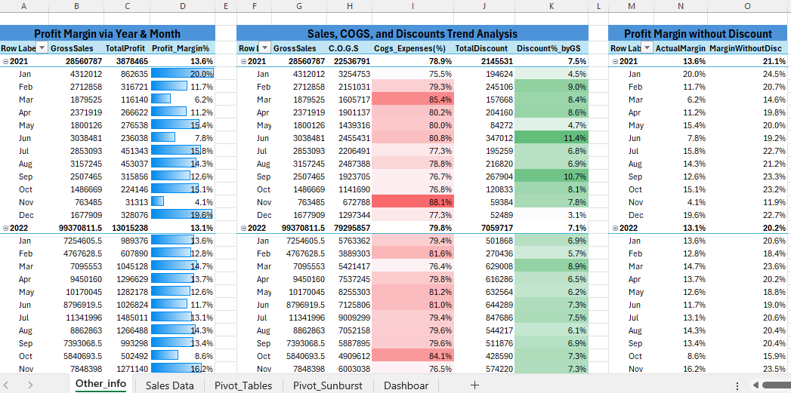

# Atlas Cycle Sales Dashboard and Pivots 🚴📊

## 📌 Project Overview  
The **Atlas Cycle Sales Dashboard** is an **Excel-based business intelligence solution** designed to analyze sales, profit, and performance trends across multiple dimensions and scenario build up by Profit Margin without Discount.
It provides key insights on revenue, profitability, customer segments, product performance, and geographic distribution – enabling data-driven decision-making for sales and marketing teams.  

---

##  Key Features / KPI 

1. **KPIs at a Glance**  
   - **Total Sales**: $11,87,26,350.26  
   - **Profit**: $1,68,93,702.26  
   - **Units Sold**: 11,25,806  
   - **Profit Margin**: 14.23%  
   - **Top-Selling Product**: PROD_ID_002 ($3,30,11,144)  

2. **Sales & Profit Analysis**  
   - Year-over-Year sales and profit comparison (2021 vs 2022).  
   - Monthly sales & profit % contribution with trend tracking.  
   - Profit generated across months visualized via line chart.  

3. **Customer & Market Insights**  
   - **Sales by Customer**: Contribution of top customers.  
   - **Sales by Market Segment**: Government (44%), Small Business (36%), Enterprise (17%).  
   - **Sales by Product Category**: Carretera, Montana, Paseo, Velo, VTT, Amarilla.  

4. **Geographic Breakdown**  
   - Country-level sales distribution (Canada, USA, India, Japan, Germany, etc.).  
   - Regional contribution to total revenue.  

5. **Interactive Dashboard Elements**  
   - Year & Month filters for dynamic exploration.  
   - Donut charts, bar charts, pie charts, and line charts for multiple perspectives.  
   - Clean design with slicers for quick drill-downs.  

6. **Margin Impact of COGS & Discounts Sheet**
    - This sheet provides a consolidated view of monthly and yearly profitability trends, showing how Gross Sales, COGS, and Discounts impact overall profit margins. It highlights the effect of costs and discounts on actual vs. potential profitability.
   - 1st Pivot **(Profit Margin via Year & Month)**  Tracks Gross Sales, Total Profit, and Profit Margin % across months and years.

   - 2nd Pivot **(Sales, COGS, and Discounts Trend Analysis)** Breaks down COGS and Discounts as a % of Gross Sales to show cost and pricing impact.

   - 3rd Pivot **(Profit Margin without Discount)** Compares Actual Profit Margin vs. Margin without Discounts to measure the effect of discounts on profitability.
---

## 🛠 Tools & Techniques Used  
- **Microsoft Excel**  
  - Pivot Tables & Pivot Charts  
  - Slicers for interactivity  
  - KPI tracking with conditional formatting
- **Power Query**  
  - Data Loading & Transformation
- **Data Visualization**  
  - Donut, Pie, Column, and Line charts  
- **Data Analysis**  
  - YoY comparison, profitability tracking, customer segmentation, and market share analysis  

---

##  Dashboard, Pivots & Data Snapshot  

---

##  Key Takeaways  
- Identified top-performing products, customers, and regions.  
- Helped monitor **Actual Sales vs Targets** effectively.  
- Delivered actionable insights to boost decision-making for marketing & sales strategies.  

